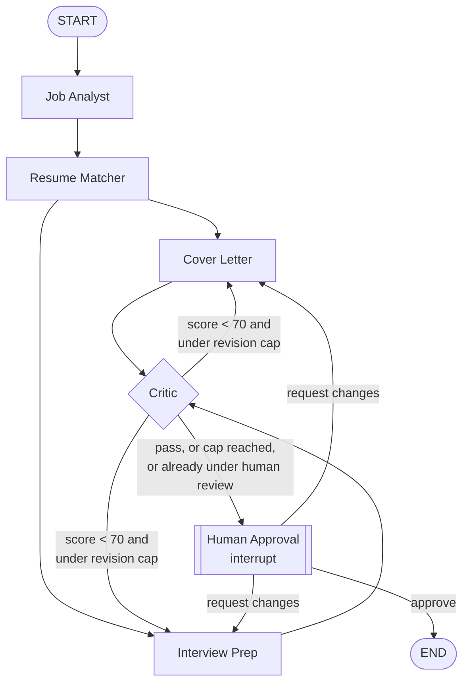

# ApplyPilot Architecture

ApplyPilot runs a job posting and a resume through five cooperating agents,
orchestrated as a LangGraph state graph, with a human approval gate before
anything is finalized.

## Graph topology

`Cover Letter` and `Interview Prep` run in parallel — both depend only on
the Resume Matcher's output, not on each other, so LangGraph schedules them
as concurrent tasks. The Critic is a fan-in point: it only runs once both
parallel branches have completed.

## Agents

**Job Analyst** (`app/agents/job_analyst.py`) — extracts role, seniority,
required/nice-to-have skills, keywords, and company signals from the raw
posting text into a validated `JobAnalysis` schema. Pure extraction, no
judgment calls.

**Resume Matcher** (`app/agents/resume_matcher.py`) — compares the
`JobAnalysis` against the resume's extracted text and produces a
`MatchReport`: a 0–100 score, strengths, gaps, and improvement suggestions.
This is the one node every downstream agent depends on, directly or
indirectly — it's the shared grounding fact base for the rest of the run.

**Cover Letter** and **Interview Prep** (`app/agents/cover_letter.py`,
`app/agents/interview_prep.py`) — both draft candidate-facing material from
the same `JobAnalysis` + `MatchReport` inputs. Neither agent is allowed to
see the raw resume directly; they're deliberately restricted to what the
Resume Matcher already verified, which is what keeps them from fabricating
experience the candidate doesn't have.

**Critic** (`app/agents/critic.py`) — scores the cover letter and interview
prep against an explicit rubric (relevance, specificity, tone, grounding)
and returns pass/fail per artifact plus targeted feedback. This is the
reflection step: instead of trusting the first draft, a second model call
independently judges the first one's output against inputs it didn't
generate itself.

**Human Approval** — not an LLM call at all. `interrupt()` pauses graph
execution and surfaces the current draft; a separate HTTP request later
resumes it with `Command(resume=...)`. See below.

## Two revision loops, one state field

`revision_count` and `critic_feedback` are shared across both loops:

- **Autonomous loop** (Critic → Cover Letter/Interview Prep → Critic): runs
  automatically while `revision_count < MAX_CRITIC_ROUNDS` (3) and the
  critic hasn't passed both artifacts. This bounds LLM cost without human
  involvement — a runaway reflection loop can't happen.
- **Human-driven loop** (Human Approval → Cover Letter/Interview Prep →
  Critic → Human Approval): once a human has reviewed the draft at least
  once (`human_review_started` flips to `True`), every subsequent critic
  pass routes straight back to human review instead of re-entering the
  autonomous loop — the system doesn't get to keep "fixing" things behind
  the human's back. This loop has no cap; a human explicitly choosing to
  request another revision is a deliberate decision, not a runaway agent.

## Human-in-the-loop persistence

Pausing mid-graph and resuming later — potentially from an entirely
different server process — requires the graph's state to be durable, not
just held in memory. `app/services/checkpointer.py` wires a `PostgresSaver`
(from `langgraph-checkpoint-postgres`) to Supabase's Postgres instance via
a connection pool. Each application uses its own `thread_id` (the
application's UUID), so `GET /run/stream`, `POST /approve`, and
`POST /reject` can all resume the exact same paused execution regardless
of which request handled the previous step.

## Observability: agent_runs and artifacts

Every node call — including retries after a rejected draft — is wrapped by
`run_agent()` (`app/agents/run_logging.py`), which:

1. Inserts an `agent_runs` row before the call (`status: running`).
2. Updates it to `completed`/`failed` with the raw output afterward.
3. Persists a versioned `artifacts` row for candidate-facing outputs (job
   analysis, match report, cover letter, interview prep) — but *not* for
   the critic's own verdict, which lives only in `agent_runs.output`.

This is what makes the timeline UI possible: `agent_runs` is a complete,
queryable audit trail of every attempt, not just the final result.

## Streaming

`run_agent()` also pushes `node_start`/`node_finish` events onto a
per-application `queue.Queue` (`app/agents/events.py`). The `/run/stream`,
`/approve`, and `/reject` endpoints run the graph in a background thread
and stream those events to the client as Server-Sent Events while the
thread executes — the frontend sees each agent go
pending → running → completed in real time, including the two parallel
branches starting within milliseconds of each other.

## Why a graph instead of a linear chain

A fixed sequence of function calls can't express any of this cleanly:
parallel branches need a fork/join point (fan-out to Cover Letter +
Interview Prep, fan-in at Critic); the revision loop needs a cycle with a
termination condition; and human-in-the-loop needs the ability to pause
*indefinitely* and resume later from different infrastructure. A state
graph makes each of these an explicit edge or node rather than ad hoc
control flow bolted onto a script.
